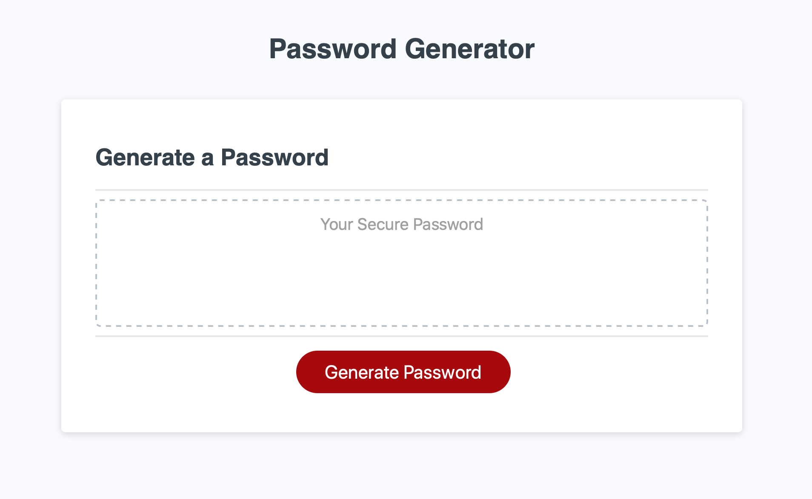
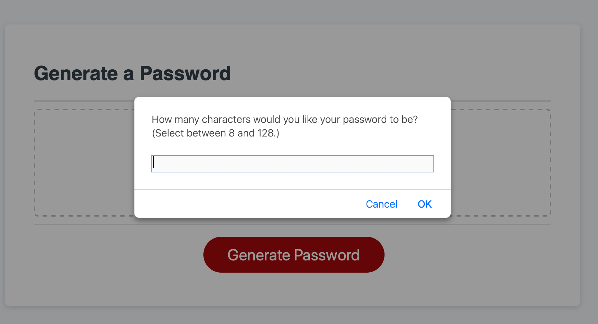
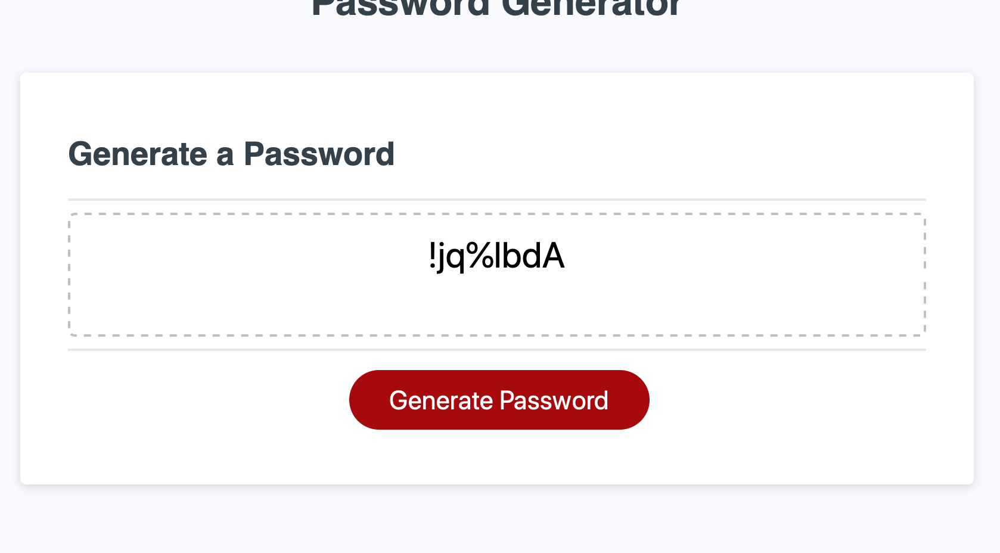

# Password Generator 
This application generates a random password based on the users selected criteria. I have assigned the user to choose a number between 8 and 128 and included four different characters that the user can choose: numbers, special charecters, lower, and upper.

If some criteria is not met, the user can not contonue until that criteria is satisfied. 

The rusult of the generated password will be shown in the box. 

Password generator layout. 

The user will be prompted to enter a value between 8 and 128. The user will be given a series of character prompts to choose wether or not to include that character type. 

Once the application is completed, the results will be shown in the box. 
